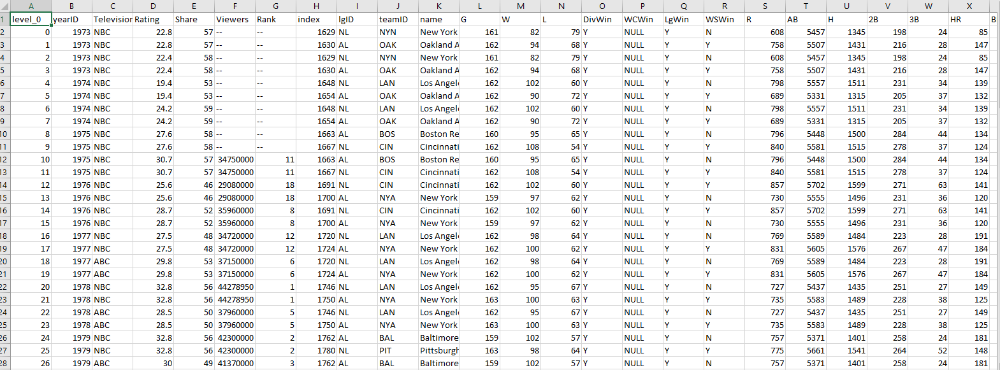

# ETL_Project-
ETL Project 

Santosh R
Eric Meyer
Adib Khan
Darrell Collison

                                                                      ETL Project
                                                                      
  For this assignment we were tasked with extracting, transforming and loading two different data sources into one queriable dataframe. We decided to do this project using Baseball Season Statistics that were in a CSV and the World Series Viewership Statistics that we scraped from a web source. 

  We began by uploading the CSV file into Jupyter Notebook and cleaning it. We first removed all the columns that didn’t have complete or relevant data. We then removed almost a century’s worth of data to focus on the more recent World Series participants which corresponded to our television Viewership Statistics. We then renamed the remaining columns so that key metrics of the participants were easily identifiable.

  Once the CSV data cleaning was completed, we uploaded the Viewership data that was scraped. We renamed the ID column and changed its data type to match the ID column from the CSV file. We then merged this two datasets on the common column and finally uploaded to Postgres where the combined data can be queried. 
 
 
 Merged CSV:
 

